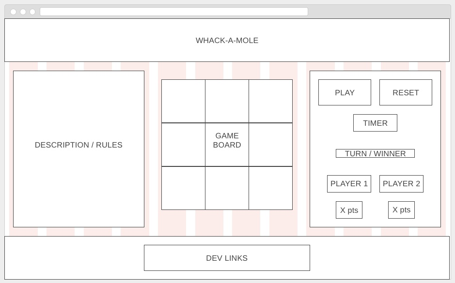
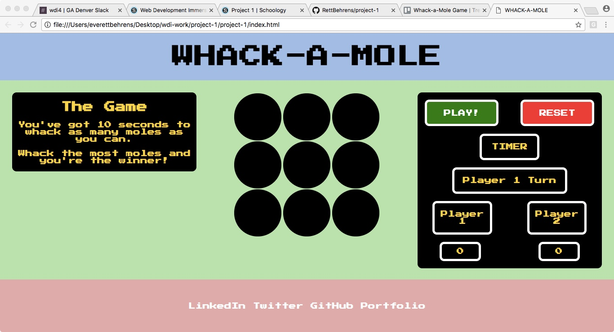

### Project 1

For my game, I'll be building Whack-a-Mole. This will require HTML, CSS, and JavaScript. I'm choosing Vanilla JS over jQuery not only to avoid downloading the jQuery library for this game but also to challenge myself to better understand JavaScript since jQuery currently seems easier. 

The game page will include the following:
* a header for the game title
* a footer for developer contact info
* a description of the game
* a gameboard consisting of 9 "mole holes"
* a score tracker that displays the scores for player 1 and 2
* a game timer that runs down to 00:00
* a countdown to start
* a game activate button
* a reset button

Functionality requirements:
* game activation upon "play game" button click
* 3-2-1 countdown giving player time between "play game" button click and game timer start
* gameboard only registers clicks during game time
* only clicks hitting moles "up" will be counted toward score
* random number generator to control where moles pop up 
* random number generator to control how many moles pop up
* random number generator to control how long moles are up
* compare scores after player 2 plays
* declares winner based on which score is higher

Trello link:
**[Whack-a-Mole Game on Trello](https://trello.com/b/mq0ZdZnC/whack-a-mole-game)**

Whack-a-Mole Wireframe

Whack-a-Mole Screenshot

Play Whack-a-Mole
**[HERE](https://rettbehrens.github.io/project-1/)**